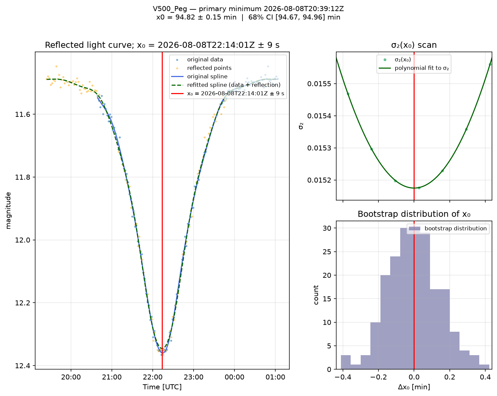
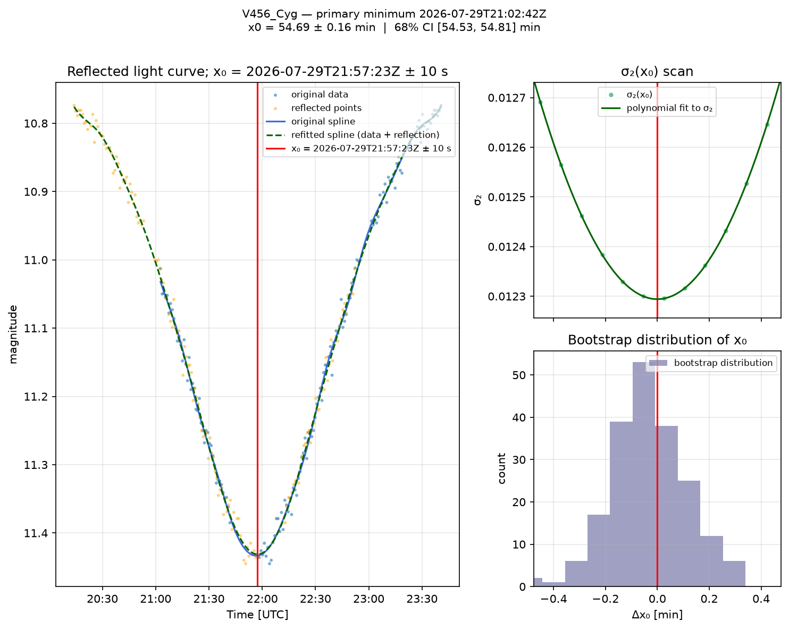
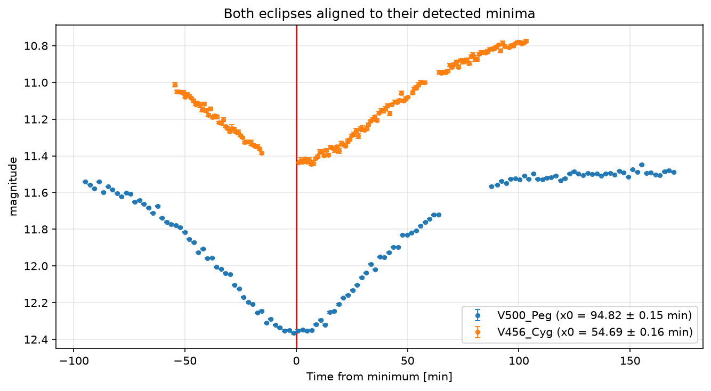

# reflection-method

Eclipsing binary minimum finder using the **reflection method** (symmetry about the eclipse minimum).

## What is this for?

About half of all stars are members of binary or multiple systems. When the
orbital plane of such a system is seen close to edge-on, the two stars
periodically **eclipse** each other: one star passes in front of the other
and briefly blocks part of its light. Seen from Earth, the star's brightness
dips and recovers — this dip is called an *eclipse* (or *minimum*), and a
plot of brightness against time is a *light curve*.

Measuring the exact moment of an eclipse minimum is one of the most important
and frequently performed tasks in stellar astronomy:

- it pins down the **period** of the system when combined with other
  eclipses (eclipse timings),
- small, periodic shifts in the timing betray the presence of a third body
  (*light-time effect*), apsidal motion, or mass exchange,
- it is the standard measurement made by thousands of **amateur observers**
  of variable stars who submit their data to databases like the AAVSO.

This is harder than it sounds. Real light curves are unevenly sampled, noisy,
and the minimum is often sampled by only a handful of points. Simply picking
the dimmest observation is meaningless — the noise can easily shift it by
minutes. Instead, one needs a robust way to use *all* points in the dip to
estimate the minimum and its uncertainty.

## How does it work?

The reflection method exploits the **symmetry of an eclipse**: the light
curve just before the minimum is a mirror image of the curve just after it.
The algorithm therefore:

1. Fits a smooth B-spline to the observed light curve.
2. Picks a trial moment `x₀` and **reflects every point about it**
   (`x → 2x₀ − x`), merging the reflected points with the original ones.
3. Fits a spline to the combined dataset and measures the residual
   standard deviation σ₂.
4. Repeats steps 2–3 for a grid of trial values: the true minimum is the
   `x₀` that makes the combined data **most symmetric**, i.e. minimises σ₂.
   The grid minimum is refined with a **local polynomial fit** to the σ₂
   curve — a quartic fitted inside a narrow window around the grid minimum
   (a parabola when fewer points are available). This is more stable than
   interpolating the σ₂ curve with a spline, which can produce spurious
   minima when the curve is flat near the minimum.
5. Quantifies the uncertainty with a **bootstrap**: residuals are resampled,
   the whole search is repeated, and the spread of the resulting `x₀`
   estimates gives the standard error and a 68% confidence interval.

The method is a modern, statistically well-founded descendant of the classic
Kwee–van Woerden algorithm (1956) and works with arbitrary, non-uniformly
sampled data, without folding the light curve.

## Who is it for?

- **Amateur variable-star observers** who want the minimum time of their
  latest observation run and an honest error bar on it — the
  [command-line interface](#cli) takes an AAVSO-format CSV and prints a
  ready-to-report time.
- **Astronomers and students** who need the algorithm in their own pipeline —
  the core is a pure, dependency-light Python API with no I/O.
- **Anyone** curious how an eclipse-minimum timing can be extracted from a
  noisy light curve.

## Installation

```bash
# Core library only (numpy, scipy)
pip install reflection-method

# With plotting (matplotlib)
pip install "reflection-method[plot]"

# With CLI (click)
pip install "reflection-method[cli]"

# Full
pip install "reflection-method[plot,cli]"
```

## Quickstart

```python
import numpy as np
from reflection_method import find_minimum

# x, y in any linear time units (JD, HJD, MJD, phase, minutes...)
x = np.array([...])  # time
y = np.array([...])  # magnitude (logarithmic scale)

# An eclipse is a *maximum* of the magnitude light curve -> find_peak=True
result = find_minimum(x, y, pts_per_knot=10, degree=3, n_bootstrap=60, find_peak=True)

print(f"Minimum at x0 = {result.x0:.4f} ± {result.x0_std:.4f}")
print(f"68% CI: [{result.x0_lo:.4f}, {result.x0_hi:.4f}]")
```

Result is a `MinimumResult` NamedTuple with all values in the **same units as input `x`**. The library performs no time conversion. If your data is already in **flux units** (eclipse = dip = minimum of `y`), simply omit `find_peak=True`.

## Algorithm

1. Fit a low-order spline to the original data
2. Scan reflection point `x0` — for each candidate, reflect all points about `x0`, combine with original, refit spline, compute residual standard deviation `σ₂`
3. Refine the grid minimum with a local polynomial fit to `σ₂` (quartic by default; see `parabola_window`)
4. Bootstrap uncertainty: resample residuals, repeat scan, compute percentiles

## Examples

### Python API

See [`examples/quickstart.py`](examples/quickstart.py) for a minimal script.

See [`examples/plot_aavso.py`](examples/plot_aavso.py) for a full worked
example on **real AAVSO photometry**: it loads two stars, finds each primary
minimum **directly on the magnitude scale** (`find_peak=True`), and saves the
diagnostic figures to `examples/plots/`:

```bash
pip install "reflection-method[plot]"
python examples/plot_aavso.py
```

See [`examples/notebook/example.ipynb`](examples/notebook/example.ipynb) for a full Jupyter notebook with step-by-step walkthrough and plotting.

### Results on real AAVSO data

Eclipse minimum of **V500 Peg** (2026-08-08, 120 points) — `x0 = 94.82 ± 0.15 min`
from start, i.e. `2026-08-08T22:14:01Z`:



Eclipse minimum of **V456 Cyg** (2026-07-29, 142 points) — `x0 = 54.69 ± 0.16 min`
from start, i.e. `2026-07-29T21:57:23Z`:



Both stars' eclipses aligned to their detected minima:



### CLI

```bash
# Install with CLI and plotting
pip install "reflection-method[plot,cli]"

# Run on AAVSO CSV file
reflection-method data.csv \
    -x DATE-OBS -y MAG -w MAG_ERR \
    -t iso -k 10 -d 3 -n 200 -b 60 -s 42 \
    -p output.png
```

**CLI Options:**

| Option | Short | Default | Description |
|--------|-------|---------|-------------|
| `--x-col` | `-x` | `DATE-OBS` | Time column name |
| `--y-col` | `-y` | `MAG` | Magnitude column name |
| `--w-col` | `-w` | (none) | Weight/error column name |
| `--time-format` | `-t` | `iso` | `iso` (DATE-OBS→UTC) or `jd` (Julian Date) |
| `--pts-per-knot` | `-k` | `10` | Points per spline knot |
| `--degree` | `-d` | `3` | Spline degree (1-5) |
| `--n-scan` | `-n` | `200` | Scan resolution for x₀ search |
| `--x0-window` | `-W` | `0.1` | Scan window as fraction of x-range |
| `--parabola-window` | `-P` | `0.05` | Fit window for polynomial refinement, as fraction of scan range |
| `--n-bootstrap` | `-b` | `60` | Bootstrap iterations |
| `--n-scan-boot` | `-B` | `80` | Scan resolution per bootstrap iteration |
| `--seed` | `-s` | (none) | Random seed for reproducibility |
| `--output`, `-o` | — | stdout | Output JSON file |
| `--plot` | `-p` | (none) | Save 4-panel plot to file |
| `--plot-format` | `-F` | `png` | `png`, `pdf`, `svg` |

**Output JSON includes:**

```json
{
  "x0": 94.82,
  "x0_std": 0.15,
  "x0_lo": 94.67,
  "x0_hi": 94.96,
  "sigma_min": 0.0152,
  "n_points": 120,
  "n_bootstrap": 60,
  "utc_time": "2026-08-08T22:14:01Z",
  "utc_uncertainty_s": 9.0,
  "parameters": {...}
}
```

The CLI handles:
- AAVSO extended format (comments, header in `#NAME,DATE-OBS,...` line)
- Time formats: `iso` (DATE-OBS→minutes + UTC), `jd`, `hjd`, `mjd`, `phase`, `minutes`
- Magnitudes used directly on the logarithmic scale (the eclipse is a *maximum*
  of the magnitude light curve; the algorithm runs with `find_peak=True`)
- Weights from `MAG_ERR`
- `--seed` for reproducible bootstrap

## API Reference

### Core functions

```python
from reflection_method import (
    fit_spline,        # Fit LSQ spline to data
    find_x0,           # Scan x0 to minimize σ₂
    refine_x0_minimum, # Local polynomial refinement of the σ₂ minimum
    bootstrap_x0,      # Residual bootstrap uncertainty
    find_minimum,      # Full pipeline
    MinimumResult,     # Result container
)
```

### Result type

```python
MinimumResult(
    x0: float,           # reflection point (input units)
    x0_std: float,       # bootstrap std (input units)
    x0_lo: float,        # 16th percentile (input units)
    x0_hi: float,        # 84th percentile (input units)
    sigma_min: float,    # minimum σ₂
    n_points: int,       # data points used
    n_bootstrap: int,    # bootstrap iterations
)
```

### Plotting (optional `[plot]` extra)

```python
from reflection_method.plot import plot_all, plot_original_spline, plot_scan

fig = plot_all(
    x, y, spl1, xr, spl2,
    x0_opt, x0_std,
    x0_grid, sigma2, spl_sigma, x0_boot,
    xlabel="Time", ylabel="magnitude", x_unit="min", invert_y=True
)
fig.savefig("output.png", dpi=150, bbox_inches="tight")
```

`invert_y=True` shows the magnitude axis with brighter stars on top, the
standard convention. Pass `find_peak=True` to `find_minimum` when working
with magnitudes (eclipse = maximum of the light curve).

### Reproducibility

Pass `rng=np.random.default_rng(seed)` to `find_minimum` or `bootstrap_x0`.

## Requirements

- Python ≥ 3.10
- numpy ≥ 1.24
- scipy ≥ 1.10

Optional:
- matplotlib ≥ 3.7 (`[plot]` extra)
- click ≥ 8.1 (`[cli]` extra)

## License

MIT